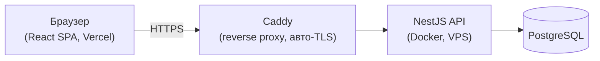
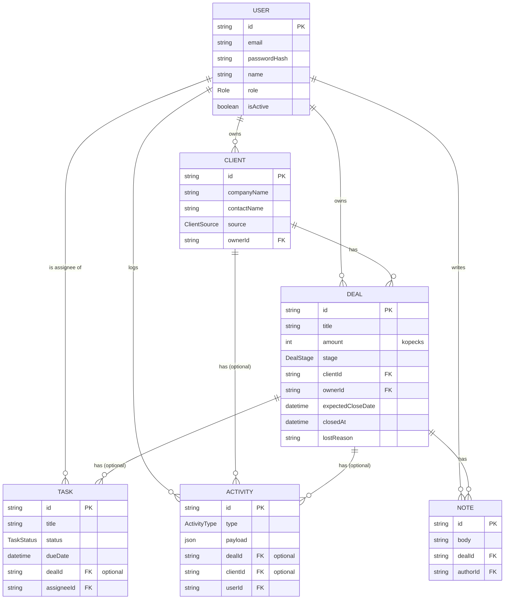

# WebStudio CRM

[](https://github.com/Kiro-DevHub/webstudio-crm/actions/workflows/ci.yml)

CRM для веб-студии: клиенты, сделки на канбан-пайплайне, задачи, журнал активности и аналитический дашборд — pet-проект, сделанный как портфолио-кейс.

**Демо:** [webstudio-crm-web.vercel.app](https://webstudio-crm-web.vercel.app) · **Swagger:** [webstudio-crm.onrender.com/api/docs](https://webstudio-crm.onrender.com/api/docs)

> API на бесплатном тарифе Render засыпает после простоя — первая загрузка демо может занять 30–50 секунд, пока сервер просыпается. Дальше всё работает быстро.

## Демо-доступ

Роль решает, что видно и что можно редактировать — попробуйте обе.

| Роль | Email | Пароль |
| --- | --- | --- |
| **ADMIN** — видит и редактирует всё, управляет пользователями | `admin@crm.dev` | `Demo1234!` |
| **MANAGER** — видит всё, редактирует только свои сделки/клиентов | `olga@crm.dev` | `Demo1234!` |
| **MANAGER** — видит всё, редактирует только свои сделки/клиентов | `dmitry@crm.dev` | `Demo1234!` |

На странице логина есть кнопка «Войти как демо-пользователь» — она подставляет креды менеджера автоматически.

## Возможности

- **Клиенты** — фильтруемая таблица, CRUD, карточка клиента с историей сделок.
  <!-- screenshot: clients-table -->
- **Сделки на канбане** — drag-and-drop между стадиями пайплайна с оптимистичным обновлением и откатом при ошибке.
  <!-- screenshot: deals-kanban -->
- **Карточка сделки** — степпер стадий, таймлайн активности, задачи и заметки.
  <!-- screenshot: deal-detail -->
- **Задачи** — с дедлайнами, исполнителями и производным статусом «просрочено».
  <!-- screenshot: tasks -->
- **Аналитический дашборд** — воронка по стадиям, динамика выручки, разбивка по менеджерам.
  <!-- screenshot: analytics-dashboard -->
- **Журнал активности** — автоматическая запись каждого значимого события (создание, смена стадии, задача выполнена, заметка).
- **Тёмная и светлая тема**, полностью на CSS-переменных, проверено на контраст AA.
- **Ролевой доступ** (ADMIN/MANAGER) на уровне API и UI.

## Стек и почему так

NestJS + Prisma даёт строгую типизацию от схемы БД до DTO без лишнего кода, а TanStack Query снимает с фронтенда всю ручную работу с кэшем и синхронизацией серверного состояния — для CRM с частыми мутациями (канбан, задачи) это принципиально. shadcn/ui поверх Tailwind v4 выбран вместо готовой библиотеки компонентов, чтобы плотная, ряд-ориентированная вёрстка B2B-инструмента не боролась с чужими отступами и радиусами. Деньги — целые копейки (`Int`), не float, чтобы не тащить в CRM ошибки округления.

## Архитектура



### ERD



## Запуск локально

```bash
docker compose up -d db
cp apps/api/.env.example apps/api/.env && cp apps/web/.env.example apps/web/.env
pnpm install && pnpm --filter @crm/api prisma migrate deploy && pnpm --filter @crm/api prisma db seed
pnpm dev
```

API — `http://localhost:3000/api`, Swagger — `http://localhost:3000/api/docs`, web — `http://localhost:5173`.

Прод-сборка (Docker + Vercel): [docs/DEPLOY.md](docs/DEPLOY.md).

## Что бы я улучшил

- WebSocket-уведомления о новых задачах и смене стадии сделки вместо polling'а.
- E-mail-уведомления о дедлайнах задач.
- Экспорт сделок и клиентов в CSV.
- Отдельный аудит-лог для действий ADMIN (сейчас это только `Activity` на доменных сущностях).
- Rate limiting на `/api/auth/*`.
